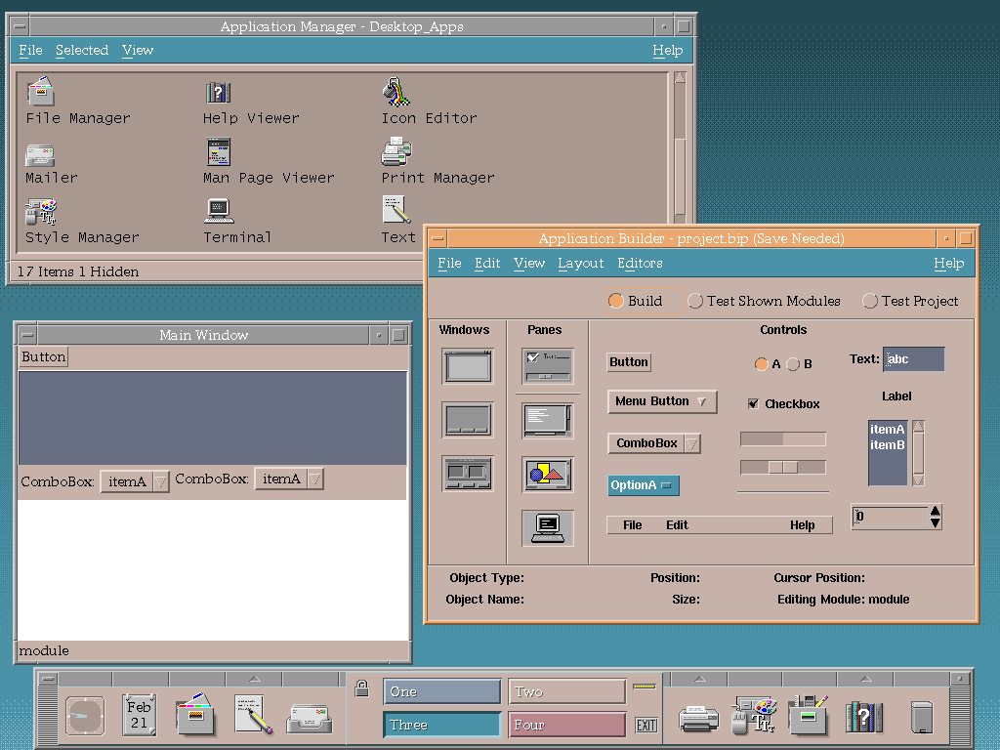
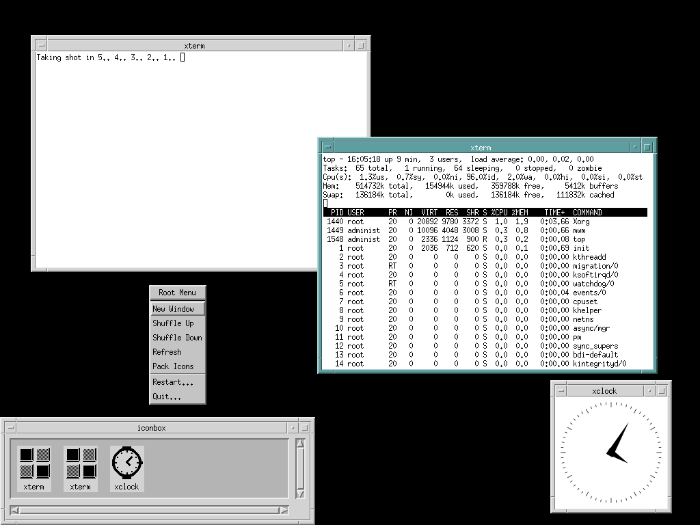
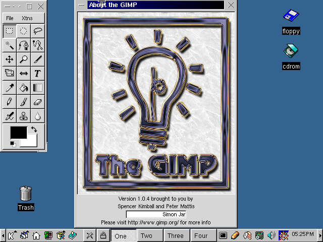
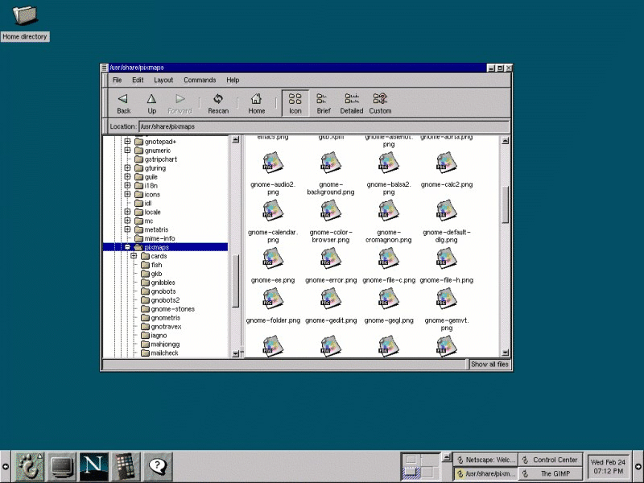

# Python ile **GTK3** Uygulama Geliştirme Eğitimi

GaziSiber Özgür Yazılım Ve Pardus Takımı
22/04/2026 - Edip Hazuri

---
### Temel Kavramlar: Kütüphane

Kendinizi 20 tane büyük projesi olan bir yazılımcı olarak hayal edin. Bir gün bütün uygulamalarınıza tıklandığında bilgisayarı yok eden bir buton eklemek istediniz. Nasıl yaparsınız?

**A)** Kodu bir uygulama için yaz sonra diğerlerine tek tek kopyala
**B)** Kodu bir kere yazıp, bütün uygulamalar için ortak bir yere koyup gerektiğinde oradan çağırmak <!--cevap-->

---
### Temel Kavramlar: Arayüz Kütüphanesi
Bir uygulama tasarlamak istiyorsunuz. Bu uygulamanın ilk aşaması olarak ekrana sadece bir buton koymak istediniz. Nasıl yaparsınız?

**A)** Ekranın piksellerini tek tek boya, butonun gölgesi için ışık açılarını hesapla, farenin koordinatlarını anlık takip etmek için binlerce satır kod yaz. 
**B)** Bir Arayüz Kütüphanesine (GTK3 gibi) sadece "Bana buraya 'Giriş' yazan bir buton koy" de. Geri kalan matematiksel hesaplamaları, görsel efektleri o halletsin.

---

# Peki GTK nasıl Doğdu?

1996 yılında Peter Mattis ve Spencer Kimball, GIMPi yazmaya karar verdiler. Ancak o dönemde kullandıkları "Motif" isimli arayüz kütüphanesi hem hantaldı hem de lisans kısıtlamalarıyla doluydu.
Peter ve Spencer, GIMP'i tamamlayabilmek için önce kendi araç kutularını yazmak zorunda kaldılar: GTK (GIMP Tool Kit) böylece bir yan proje olarak doğdu.

---
# Peki GTK nasıl Büyüdü?
Peter Mattis ve Spencer Kimball'ın yazdığı bu arayüz kütüphanesi o kadar iyi ve kadar o esnek oldu ki. 1997 yılında başlayan GNOME masaüstü ortamı, tüm masaüstü ortamını GTK üzerine inşa etmeye karar verdi.
Bundan sonra GTK, GNOME'un projesi haline geldi ve ismi Gnome ToolKit oldu 

---

---

### Gtk3 için ortamı hazırlayalım.
- git clone https://github.com/vilez0/gtk3-examples
- sudo apt install glade build-essential pkg-config libgtk-3-dev python3-gi python3-gi-cairo gir1.2-gtk-3.0
